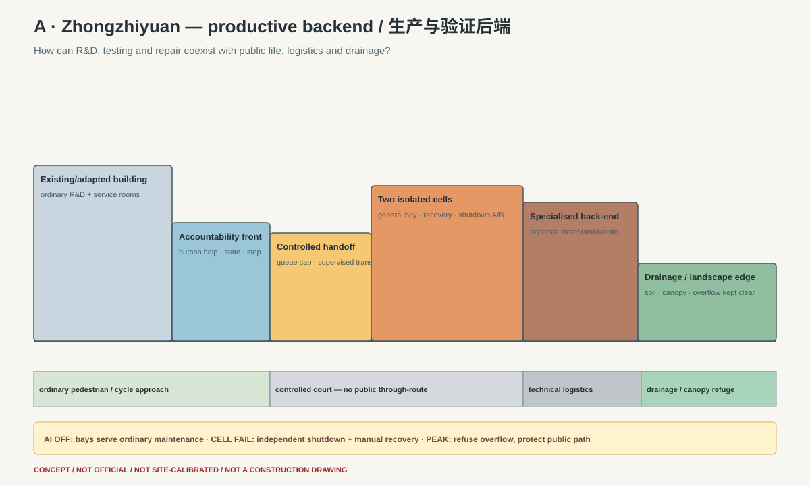
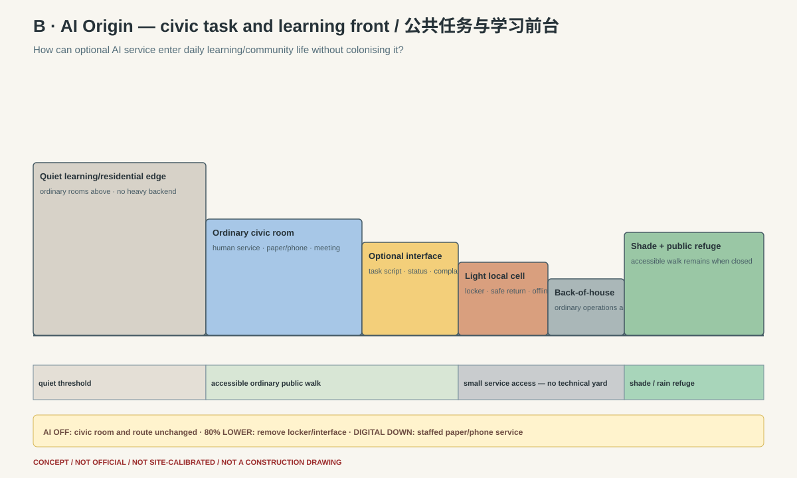
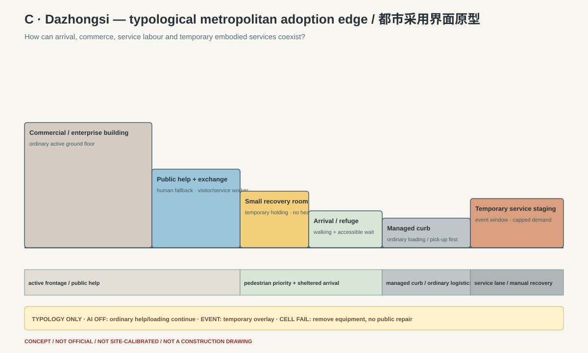

# Three Key-Area Section Gate

All three are conceptual urban sections. None is a construction section, official location, parcel proposal or claim about an existing building. They use the same common contextual evidence base and explicitly preserve its Dazhongsi/provisional geometry warning.

## Section A — Zhongzhiyuan productive backend



### Urban question

How can productive R&D, controlled testing, maintenance and recovery coexist with public frontage, ordinary movement, technical logistics and a drainage/landscape edge?

### Section sequence

```text
ordinary R&D/adapted building
→ public accountability frontage
→ ordinary pedestrian/cycle approach
→ controlled handoff court
→ two independent general cells
→ specialised store/wash/isolation/maintenance backend
→ technical logistics route
→ protected drainage/canopy edge
```

The public sees who operates, what state the service is in, how to stop/complain and the non-AI alternative. It does not share repair noise, calibration, batteries, hazardous tools or incident queues. Clean, human-contact and hazardous chains are separated. A cell failure cannot close the public approach, landscape edge or the second cell.

**AI-specific spatial delta:** two independent shutdown domains, task-derived segregated stores/wash/isolation, module/calibration threshold and public status/stop interface. Without the shared layer, the section becomes a smaller ordinary service/maintenance court.

**Kill:** if these separations require a new depot campus, consume the public/landscape edge or cannot fit ordinary service access, move specialised work elsewhere or reject the backend.

## Section B — AI Origin civic task and learning front



### Urban question

How can optional AI/service experimentation enter ordinary community and learning life without equipment, queues and logistics taking over?

### Section sequence

```text
quiet learning/residential edge
→ ordinary civic room with human/paper/phone service
→ optional task-script/accountability interface
→ light locker + safe return cell
→ ordinary operations back-of-house
→ accessible shaded public walk/refuge
```

There is no heavy bay, hazardous chain, public robot queue or technical yard. The room is a civic/learning facility first. Task inversion is made publicly inspectable: people can define a need, reject automation, see failures and ask for human service.

**AI-specific spatial delta:** a removable requirements/status surface, secure module checkout/return, small safe holding and offline stop. Without the shared layer, these leave and the civic room, quiet edge and walking/refuge system are unchanged.

**Kill:** if the space is privately controlled, app-gated, lacks lawful public access or has no staffed non-digital service, it cannot represent the public task front.

## Section C — Dazhongsi typological metropolitan adoption edge



### Urban question

How can metropolitan arrival, enterprise/commercial exchange, service labour, conventional curb/logistics and temporary embodied services coexist in normal and event states?

### Section sequence

```text
ordinary commercial/enterprise frontage
→ public help and exchange room
→ small temporary recovery/holding room
→ sheltered accessible arrival
→ managed conventional loading/pick-up curb
→ temporary service staging
→ service lane/manual recovery
```

This is deliberately a typology because `PROV-KEY-003` is not anchored to Dazhongsi station and the official polygon is missing. It does not claim a station quadrant, curb, building or ownership condition.

**AI-specific spatial delta:** a capped temporary holding/recovery room, state/stop/human fallback interface and removable service staging. Without it, ordinary visitor help, loading, accessible pick-up and building operations continue.

**Kill:** if field/transport/property evidence cannot provide a managed edge without worsening walking, cycling, refuge, loading or night operations, remove the embodied service layer.

## Seven-state section test

| State | Zhongzhiyuan | AI Origin | Dazhongsi typology |
|---|---|---|---|
| AI off | cells close; ordinary maintenance/R&D/public frontage continue | civic room, human service and walk unchanged | public help, commerce, loading and accessible arrival continue |
| 80% lower adoption | operate one reversible bay; second cell not built/fit-out removed | remove locker/interface; keep civic room | no permanent staging; use ordinary operations room/curb |
| peak demand | dedicated/capped capacity; reject overflow into public/green space | appointment/queue cap; ordinary public use protected | refuse excess arrivals; conventional modes remain primary |
| one cell failure | isolate failed domain; second cell + manual route | local cell closes; civic service continues | equipment removed by service lane; no public repair |
| rain/heat | technical waiting stays inside; drainage/canopy edge remains clear | shaded/rain refuge and accessible route have priority | sheltered arrival has priority; staging may close |
| event | controlled demonstration separated from logistics/public path | civic event uses ordinary room; AI remains optional | temporary overlay with stewarding and normal evacuation |
| maintenance | separated store/wash/waste and technician welfare | ordinary back-of-house; quiet edge protected | short holding only; heavy work returns to Zhongzhiyuan/specialist backend |

## Cross-section kill test

The three drawings are not the same station with different labels:

- Section A has the only heavy/specialised technical backend and dual isolation cells.
- Section B is a civic/learning room with only a light removable cell.
- Section C is a typological arrival/curb/service interface with temporary holding and no heavy repair.

Deleting the shared layer changes each section differently but does not destroy the ordinary city. That is the admission condition, not a weakness.

```text
C01_THREE_SECTIONS_COMPLETE=true
SECTION_DIFFERENTIATION=PASS_CONCEPTUAL
SITE_RESOLUTION=BLOCKED_BY_OFFICIAL_GEOMETRY_AND_SURVEY
```
