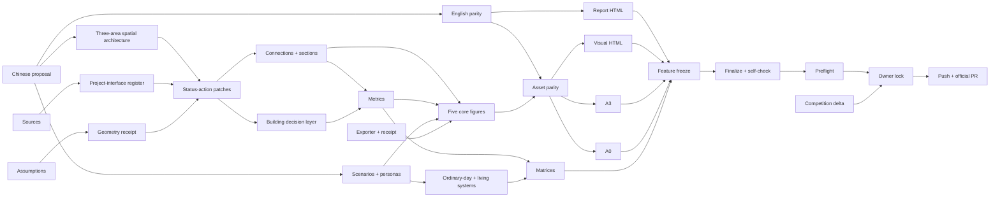

# Formal Execution Roadmap — 2026-08-20

Status: `FROZEN_FOR_EXECUTION / changes require a dated delta`  
Working production candidate: `京张续城 / Jing-Zhang In Place`  
Final winner: `OWNER_DECISION_REQUIRED`  
Feature freeze: `2026-08-18`  
Validation/repair only: `2026-08-19`  
PR target: `2026-08-20`

## Production contract

The formal package lives at `V:\src\haidian\submissions\JerrySkywalker\jingzhang-in-place` on `submission/JerrySkywalker/jingzhang-in-place`. It follows the current canonical Skill and package v2 bilingual contract. The design-lab is the rationale and evidence-memory layer; only curated public, competition-appropriate material migrates.

The package remains `scaffold` until text, geometry, matrices, figures, A3/A0, bilingual parity and four review gates are genuinely ready. The working candidate may be produced reversibly while `FINAL_WINNER=OWNER_DECISION_REQUIRED`; no official PR is authorized by this kickoff.

## Critical path

```text
working production candidate authorization
→ evidence-status / action / section architecture
→ topology-safe geometry and exact precision labels
→ recomputed metrics and matrices
→ five bilingual core figures
→ bilingual proposal / visual / A3 / A0 parity
→ official HTML render and manifest refresh
→ finalize
→ deterministic + spatial + visual + professional self-check
→ participant preflight --check-push
→ exact-head competition-delta audit
→ Owner final lock
→ push and official PR
```

The current controlling dependency is not naming. It is the transition from a typological `STATUS × ACTION` baseline to evidence-tied geometry and three unequal professional sections without inventing parcels, buildings or engineering capacity.

## Executable task register

| ID | Deliverable | Repository / path | Input dependency | Owner / agent role | Lane | Definition of done | Validator / gate | Latest safe date | Failure / rollback |
| --- | --- | --- | --- | --- | --- | --- | --- | --- | --- |
| A01 | Chinese proposal v1 | formal `/proposal.md` | ADR-0005, C05 concept, official template | Implementer drafts; Owner direction already bound | A DESIGN/TEXT | Every official section contains C05-specific spatial, ordinary-city, AI and implementation claims; no scaffold prose | professional review + source-token scan | 08-14 | keep v0.1 and mark unresolved paragraphs; never invent fact |
| A02 | Three-area plan/section brief | formal proposal + figure specs | A01, current evidence | Implementer; later urban-design professional | A DESIGN/TEXT | north/middle/south each has plan logic, section, users, service, ordinary life, AI, trigger and stop | three-area non-repetition audit | 08-14 | revert repeated module to context/section question |
| B01 | Formal source ledger | formal `/sources.json` | official registry + R5 public sources | Implementer evidence lead | B SOURCES | every material claim has publisher, URL/path, date, authority, support limit, reuse and consequence | local validator + manual citation audit | 08-14 | demote unsupported claim to assumption or remove |
| B02 | Assumption/unknown register | formal `/assumptions.json` | geometry, building, access, utility gaps | Implementer | B SOURCES | exact boundary, Dazhongsi mismatch, parcels, title, building condition, controls, capacity and surveys explicit | risk compliance review | 08-14 | fail closed to `UNKNOWN`; remove precision |
| B03 | Current-project interface register | formal evidence data / proposal | park, water, station and renewal status | Implementer + future professional confirmation | B SOURCES | each asset distinguishes built/open, works-complete/open-unknown, approved/in-delivery and unknown | source/as-of audit | 08-15 | do not draw proposed overlay on uncertain work |
| C01 | Official/provisional geometry receipt | formal `/geometry/site_boundary.geojson`, `key_areas.geojson` | organizer geometry | Implementer geometry lead | C GEOMETRY | flags and precision warnings are consistent; exact geometry triggers full rebuild | `validate_local_submission`, spatial review | 08-14 | retain provisional envelope; never fabricate exact polygon |
| C02 | Status/action patch layer | formal design GeoJSON | A02, B01-B03, C01 | Implementer; later professional survey | C GEOMETRY | patches contain status, source, limit, action, trigger, section, responsibility, stop/go, exit/reuse | topology + evidence-link audit | 08-15 | leave empty/typological when carrier evidence absent |
| C03 | Four connection families + three sections | formal roads/public/figure source | A02, access/transport evidence | Implementer + transport/urban-design reviewer | C GEOMETRY | public, grade-separated, controlled and transit-water-heritage interfaces are distinct; three areas unequal | spatial review | 08-15 | remove precise alignment; keep section typology |
| C04 | Building/renewal decision layer | formal `/geometry/buildings.geojson` | building/user/rights surveys | Professional input required for final | C GEOMETRY | no building-specific action without verified structure/fire/heritage/access/title/users | professional review | 08-17 | remain `SURVEY_REQUIRED`; no action polygon |
| D01 | Deterministic metrics | formal `/metrics.json` | C01-C04 | Implementer | D METRICS | every known metric is derived from referenced files; unknown values are null with reason | deterministic validator | 08-15 | demote unverifiable metric to unknown |
| D02 | Three formal matrices | formal matrices | A01, B01-B02, C01-D01 | Implementer | D METRICS | requirements/standards/depth map to real sections, files and status; incomplete remains incomplete | schema + cross-reference audit | 08-15 | restore honest status; never flip for score |
| E01 | Scenario/persona architecture | formal `/scenarios.json` + proposal | three Task-to-Space packets | Implementer | E SCENARIOS | >=10 scenarios, >=3 industry validation, >=5 personas; each has state, TTL, space, privacy, human/offline and exit | agent.3 + AI double test | 08-14 | delete weak AI label; retain NO-BUILD result |
| E02 | Ordinary-day / Living Systems receipts | proposal + matrices | E01, C02-C03 | Implementer with later discipline reviewers | E SCENARIOS | eight user groups × operating states and soil/drainage/canopy/maintenance/noise-light consequences alter design | candidate-neutral gates | 08-16 | change route/space/phasing or record failure |
| F01 | Figure build source + receipt | design-lab `formal-readiness/build_jingzhang_in_place_baseline_artifacts.py`, run `EXPORT_RECEIPT.json` | C/D/E data | Implementer | F FIGURES | one command produces stable, offline paired outputs and SHA receipt without placing disallowed code/JSON under the submission package | rebuild hash + asset scan | 08-15 | retain last known source/output; do not edit PNG by hand |
| F02 | Five core figures v1 | formal `/assets/figures/*` | C01-C04, D01, E01 | Implementer + later design review | F FIGURES | each answers one question, has data/precision legend and paired zh/en text | visual + spatial review | 08-15 | use schematic concept diagram with explicit limit |
| G01 | Brand direction v1 | proposal + board system | public-language and peer-collision test | Owner for final choice; Implementer prepares | G CULTURE/BRAND | name works without AI jargon; avoids rail/circuit cliché; culture and operations are spatially anchored | public comprehension + direct-ND check | 08-16 | keep working name; do not change proposition |
| H01 | English proposal parity v1 | formal `/proposal.en.md` | section-frozen A01 | Implementer; human bilingual audit later | H BILINGUAL | every heading and material claim has semantic counterpart; source IDs and warnings match | translation parity gate | 08-15 | mark package not ready; never claim parity |
| H02 | Text-bearing asset parity | paired figures, visual, A3/A0 | F02, H01 | Implementer | H BILINGUAL | every text asset has zh/en pair or declared neutral status | manifest bilingual contract | 08-16 | exclude unpaired asset from final package |
| I01 | Paired offline report HTML | formal `/report/proposal*.html` | A01, H01 | official renderer | I HTML | official renderer succeeds; no remote requests; links resolve | render + offline scan | 08-15 | rerun official renderer; fix Markdown, not HTML by hand |
| I02 | Paired visual HTML | formal `/visual/index*.html` | F02, H02 | Implementer exporter | I HTML | responsive offline index exposes all five figures and precision warning | visual review + no-remote scan | 08-16 | fall back to static local index |
| J01 | A3 booklet v1 | formal `/drawings/a3-booklet*.pdf` | A/H/F stable | Implementer exporter + visual review | J A3/A0 | correct A3 size, paired language, legible render, sources/limits and narrative sequence | `pdfinfo`, Poppler render, visual review | 08-16 | rebuild from source; never patch PDF manually |
| J02 | A0 boards v1 | formal `/drawings/a0-boards*.pdf` | A/H/F stable | Implementer exporter + visual review | J A3/A0 | correct A0 size, paired language, five core figures and readable hierarchy | `pdfinfo`, Poppler render, visual review | 08-16 | reduce content/reflow; keep deterministic source |
| K01 | Incremental validation | formal working tree | each upstream deliverable | Implementer | K VALIDATION | validators run after each checkpoint; all findings classified | local/spatial/visual/professional | daily | do not game gate; open specific production task |
| K02 | Feature-freeze gate | formal exact head | A01-J02 | Implementer + Owner/chief review | K VALIDATION | content, geometry and figures frozen; only evidence/consistency/validator fixes allowed | freeze checklist | 08-18 12:00 CST | if unmet, explicitly move deadline state to YELLOW/RED |
| K03 | Full finalization and self-check | formal exact head | K02 | Implementer | K VALIDATION | finalize succeeds; all four evidence gates PASS; `--mark-self-checked` only on true exact head | official self-check | 08-19 | repair bounded finding, refresh manifest, rerun full ladder |
| K04 | Participant preflight | formal exact head | K03, clean branch | Implementer | K VALIDATION | scope/authorship/remotes/self-check/push dry-run all PASS | `participant_preflight --check-push` | 08-19 | no PR; repair scope or fork permission |
| L01 | Competition delta audit | current upstream catalog | K02/K04 exact official head | Implementer evidence review | L PR/REVIEW | only direct near-duplicate risk assessed; no candidate tournament reopened | six-axis C05 comparison | 08-19 | Owner portfolio decision if direct duplicate emerges |
| L02 | Final Owner lock | morning brief + final artifacts | K04, L01 | Owner | L PR/REVIEW | working candidate/display-name/portfolio risk explicitly accepted or declined | Owner decision | 08-20 pre-PR | no official PR without lock |
| L03 | Push and official PR | fork branch / upstream PR | L02, exact clean head | Implementer | L PR/REVIEW | branch pushed, exact head recorded, PR checks launched, no upstream direct mutation | GitHub + CI | 08-20 | close/hold PR if gate fails; never force-push |

## Dependency DAG



Parallel lanes after the spatial/action architecture freezes:

- B sources and E scenarios can advance alongside C geometry;
- H translation proceeds chapter-by-chapter after terminology and section freeze;
- F figures begin from stable geometry/metrics subsets while other chapters continue;
- I HTML and J PDF run from the same paired assets;
- K incremental validators run continuously, but final self-check waits for all artifact hashes.

## Daily freeze plan

### 08-13 — baseline and pipeline

Fork/workspace, Skill, `.venv`, scaffold, working branch, source/assumption/scenario migration, bilingual v0.1, concept geometry warnings, five deterministic figures, paired HTML and A3/A0 smoke outputs. Roadmap is frozen and initial validator receipt is captured.

### 08-14 — content and geometry v1

Chinese proposal v1; three key areas at plan/section depth; >=10 scenarios, >=3 validation scenarios, >=5 personas; real status/action patch specification; sources, assumptions and matrices substantially populated. No fabricated parcel/building action.

### 08-15 — metrics, figures, English

Topology-safe geometry family, derived metrics, five core figures v1, English semantic parity v1 and offline HTML v1. Any missing building/engineering input is an explicit data gap, not a guessed value.

### 08-16 — package composition

A3/A0 v1, visual index, culture/brand/landmark/operation content, paired text-bearing assets, PDF render QA.

### 08-17 — design-quality revision

Cross-artifact consistency, three-area non-repetition, ordinary-day/living-systems consequences, bilingual parity, professional/risk audit and bounded direct-near-duplicate check.

### 08-18 — FEATURE FREEZE

Freeze concept, geometry, metrics, figure system and wording. After 12:00 CST only evidence corrections, internal-consistency repairs and validator-required fixes may change content.

### 08-19 — validation and repair only

Run finalize, deterministic, spatial, visual, professional, full self-check and participant preflight with `--check-push`; refresh manifest after every repair. Repeat full ladder on the final exact head.

### 08-20 — delivery

Fetch official main, perform exact-head/contract/direct-duplicate delta audit, obtain Owner final lock, push fork branch, open official PR, and respond only to immediate blockers. No force-push or upstream direct mutation.

## Definition of done and rollback

The production package is done only when the readable proposal, bilingual outputs, nine design layers, metrics, three matrices, sources, assumptions, five local figures, A3/A0, offline HTML, four-gate self-check and preflight describe the same design at the same exact head. Schema validity alone is insufficient.

Rollback is artifact-level and reversible:

- unsupported fact → demote to assumption or remove;
- unverified geometry → empty/typological layer with explicit gap;
- weak AI space → `NO BUILD` and ordinary-space reuse;
- repeated area module → return to the area's actual section/constraint;
- exporter defect → rebuild from pinned source and last stable input;
- gate failure → do not mark ready/self-checked and do not open PR;
- Owner declines working candidate → preserve branch as production study; do not rewrite design-memory history.
