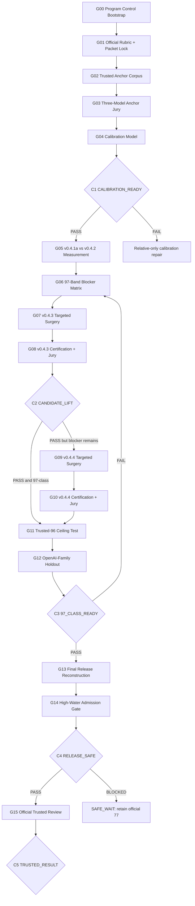

# JZ-97 Convergence Train

**Program ID:** `JZ-97-CONVERGENCE-TRAIN-001`  
**Role:** canonical long-horizon control document for post-intake score convergence  
**Official product repo:** `JerrySkywalker/haidian`  
**Official canonical repo:** `open-city-ai/haidian`  
**Control/design-memory repo:** `JerrySkywalker/jingzhang-ai-design-lab`

## 1. Mission

Raise **京张续城 / Jing-Zhang In Place** from the merged trusted baseline of 77 toward a defensible **97-class** candidate without score-fishing, fabricated precision, official-repository drift, or regression below the accepted high-water.

The original submission implementation is complete. This Program governs only post-merge calibration, bounded score-lift, ceiling qualification, and safe official re-review.

## 2. Immutable anchors

- Official trusted baseline head: `1d5cb1aaa9d76edc3532e593c803cb936070a744`
- Official trusted score: `77`
- Official merged PR: `open-city-ai/haidian#2744`
- Frozen v0.4.1a checkpoint: `94c51f2011a365a1cb2674a62f8cc3af7aba59e5`
- Current local candidate v0.4.2: `a489aa56e07a206e308fd53d6c3dbdf44dcf1f89`
- Existing draft successor PR: `open-city-ai/haidian#2774`, intentionally Draft until release admission is safe.

Never rewrite prior checkpoints. New repairs create new heads.

## 3. Execution model

### Host development

- Primary implementer: AGY `gemini-3.7-flash-high`
- Normal host invocation: `agy --dangerously-skip-permissions --model gemini-3.7-flash-high`
- Explorer/Critic subagents: `pro` tier
- Worker subagent: `inherit`
- Validator subagent: `flash`

### Formal local jury

Run only in physically isolated Windows Sandbox packets with exact model pinning:

- Reviewer A: `claude-opus-4-6-thinking`
- Reviewer B: `claude-sonnet-4-6`
- Reviewer C: `gemini-3.7-flash-high`
- Tie-breaker only when required: `gpt-oss-120b-medium`

Formal jury reviewers do **not** use host `--dangerously-skip-permissions` and do not see host history, GitHub, MCP, other reviewer outputs, or candidate chronology.

### OpenAI-family holdout

Reserve a single late-stage ChatGPT GPT-5.6 Sol holdout for G12. It is not an official score. The official maintainer review currently uses the official review pipeline/default OpenAI-family model and remains external to this Program.

Codex CLI is not a planned dependency; use only as an explicitly authorized scarce fallback.

## 4. Score semantics

Current official rubric must be re-pinned from latest upstream before calibration. Historical weights are:

| Dimension | Weight |
|---|---:|
| brief_alignment | 20 |
| originality | 10 |
| ai_planning_innovation | 15 |
| implementation_feasibility | 20 |
| public_interest_inclusion | 10 |
| risk_compliance | 10 |
| expression_completeness | 15 |

Formal local jury bands must be integers `0..5`; fractional host bands are advisory only.

A 97-class integer vector effectively requires exceptional performance in nearly every dimension. At minimum, `brief_alignment=5` and `implementation_feasibility=5`; no majority dimension may be <=3.

## 5. Program DAG

### 5.1 Accelerated Convergence v2 Architecture (Compound Trains)

To compress multi-session cadence without violating gate authority or evidence isolation, the Program supports a compound orchestration layer over canonical Goals G01–G15:

- **A1 = G03 + G04 + G05 + G06 + QuickScore bootstrap**
  - Calibration foundation: 5 core anchors (`N4`, `X8`, `B2`, `W7`, `J9`) evaluated by isolated 3-model jury (G03) + deterministic calibration layer (G04) -> Gate C1.
  - Candidate measurement: neutral reproducible packets for `v0.4.1a` vs `v0.4.2` evaluated by calibrated jury (G05).
  - Blocker matrix: 7-dimension integer blocker breakdown and at most two surgical targets (G06).
  - Iteration bootstrap: lightweight local advisory tool (`tools/jz_quickscore.py`, Sonnet default).
- **A2 = v0.4.3 single-shot targeted score lift**
  - Surgical intervention addressing at most two primary blockers from G06 on a clean product branch.
- **A3 = v0.4.3 formal jury + conditional one-surgery v0.4.4**
  - Formal 3-model isolated jury evaluation of v0.4.3 -> Gate C2 -> Optional bounded single-surgery v0.4.4 only if required.
- **A4 = trusted-96 ceiling + OpenAI-family holdout**
  - G11 trusted-96 blind comparison -> G12 single GPT-5.6 Sol holdout -> Gate C3.
- **A5 = final release reconstruction + high-water admission**
  - G13 clean upstream reconstruction -> G14 official high-water guard audit -> Gate C4 -> G15 official trusted queue.

**Compound Train Governance:**
1. Original G01–G15 contracts remain canonical and authoritative.
2. Program Gates (C0..C5) are hard stops; no compound train may skip an unsatisfied gate.
3. QuickScore is strictly `DEV_ADVISORY` and must NEVER set C1, C2, C3, or C4 to PASS.
4. Five core anchors (`N4`=77, `X8`=86, `B2`=90, `W7`=90, `J9`=96) form the primary calibration set; `L5` and `P3` are held in reserve for diagnostic escalation.

## 6. Gate contract

| Gate | Purpose | PASS requirement | On failure/block |
|---|---|---|---|
| C0 CONTENT_BASELINE | certified local content exists | v0.4.2 gates PASS | repair locally, never rewrite official baseline |
| C1 CALIBRATION_READY | local jury has useful predictive/relative behavior | trusted anchors, reproducible packets, no catastrophic rank inversion; absolute score only if error is acceptable | use relative-only pairwise/bands; do not start blind score-chasing |
| C2 CANDIDATE_LIFT | new content is a real improvement | >=2/3 reviewers support target lift, no majority regression, all product gates PASS | keep previous candidate |
| C3 97_CLASS_READY | candidate merits ceiling/release treatment | near-97 integer band structure, calibrated support, final vs trusted-96 is tie-or-better, OpenAI-family holdout has no major blocker | return to blocker matrix, bounded surgery only |
| C4 RELEASE_SAFE | successor cannot silently replace 77 with a regression | actual current official high-water protection active, or explicit Owner risk acceptance | SAFE_WAIT |
| C5 TRUSTED_RESULT | official exact-head review closed | trusted maintainer result captured and reconciled | closeout per score/result |

All gates are one of `PASS`, `FAIL`, `BLOCKED`, `OWNER_REQUIRED`; avoid soft language such as “probably pass”.

## 7. Train A — Calibration Foundation

- **G01** locks latest official rubric, integer score schema, packet composition, visual exposure, and queue semantics.
- **G02** builds a trusted anchor corpus, target >=5 exact-head packages spanning roughly 77/86/90/90/96.
- **G03** runs one valid verdict per anchor per isolated reviewer. No rerolls for low scores.
- **G04** computes reviewer bias, aggregate error, rank/pairwise accuracy and a conservative calibration layer. No complex overfit on a five-anchor dataset.

No v0.4.3 content work before C1.

## 8. Train B — Measure Current Candidate

- **G05** blind-scores v0.4.1a and v0.4.2 with the calibrated jury.
- **G06** converts the result to an integer 97-band blocker matrix: freeze majority-5 dimensions, identify exact evidence needed for each majority-4, treat <=3 as major blockers.

## 9. Train C — Surgical Score Lift

- **G07/G08** create and judge v0.4.3 only from explicit blocker evidence; at most two primary surgeries.
- **G09/G10** are optional. v0.4.4 is admitted only if a specific blocker remains and at least two independent advisers agree the surgery is material and bounded.

Anti-bloat rule: do not raise page count, tables, KPIs, scenario cards or terminology unless they directly resolve a reviewer-visible deficiency. Prefer substitution/recomposition over accumulation.

Core design grammar to preserve unless evidence compels change:

`heterogeneous existing city -> STATUS × ACTION -> ordinary-space sufficiency -> AI spatial admission -> 12 tasks / 3 deep / 9 NO-BUILD -> minimum reversible spatial delta -> stop/reset -> ordinary city`

## 10. Train D — Ceiling Qualification

- **G11** blind-compares the final candidate against a trusted 96-point anchor under identical packet semantics. A 97-class candidate should be majority tie-or-better with no clear loss in critical dimensions.
- **G12** performs one GPT-5.6 Sol OpenAI-family holdout using neutral packets and the current official rubric/prompt contract. It is evidence, not an official score.

## 11. Train E — Safe Release

- **G13** reconstructs the winner on then-current upstream/main rather than pushing an experiment branch directly. Product subtree identity, clean-clone gates, manifest and packet hashes must match.
- **G14** inspects actual current official review-worker code/tests and release policy. PR state alone does not prove high-water protection.
- **G15** is the only official trusted re-review. Exactly one final candidate enters the queue; do not score-fish identical heads.

## 12. Cross-repository contract

This repository is the **Program/Control Plane**. `JerrySkywalker/haidian` is the **Submission/Product Plane**. `open-city-ai/haidian` is the **Official Canonical Plane**. `V:\src\_review_isolation` is the **local ephemeral jury runtime**.

Program roadmaps, goals, calibration, jury verdicts, benchmark strategy, agent instructions and run receipts must never be migrated into the official submission package. See `docs/PROGRAM_CONTROL_AIRLOCK.md`.

## 13. Timebox to 2026-08-31

Preferred sequence:

- Aug 20–21: G01–G02
- Aug 21–22: G03–G04 / C1
- Aug 22: G05–G06
- Aug 22–24: G07
- Aug 24–25: G08 / C2
- Aug 25–27: optional G09–G10
- Aug 27: G11
- Aug 27–28: G12 / C3
- Aug 28–29: G13
- Aug 29–30: G14 / C4
- Aug 30–31: G15 or SAFE_WAIT buffer

If release safety remains blocked, retain the merged official 77 rather than force a risky successor.

## 14. State authority

- Human-readable current pointer: `docs/CURRENT_PROGRAM.md`
- Machine-readable state: `state/JZ97_PROGRAM_STATE.json`
- Goal contracts: `goals/JZ97-G01-*.md` through `goals/JZ97-G15-*.md`
- Durable run evidence: `runs/<RUN_ID>/`

Each Goal must read this roadmap and machine state before mutation, enforce admission requirements, write receipts, and transition state only when exit criteria are proven.